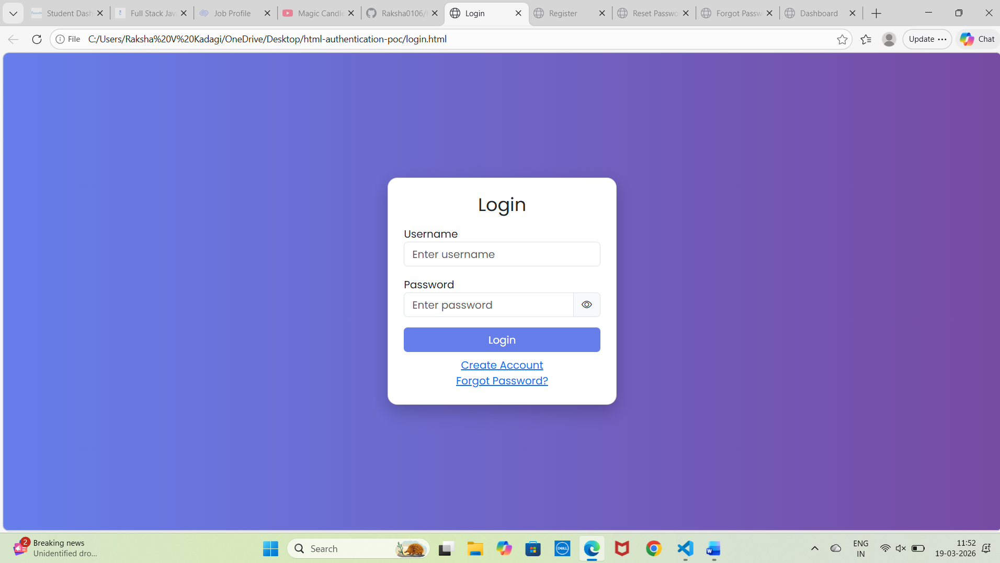
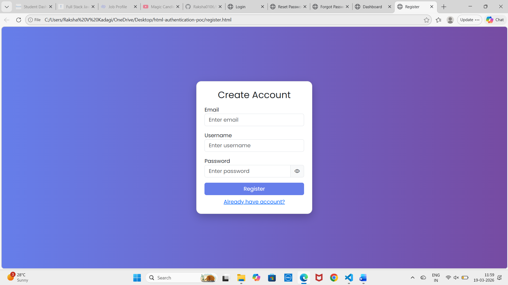
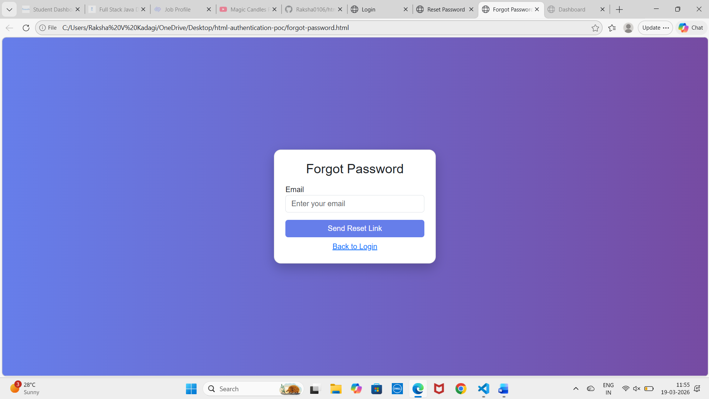
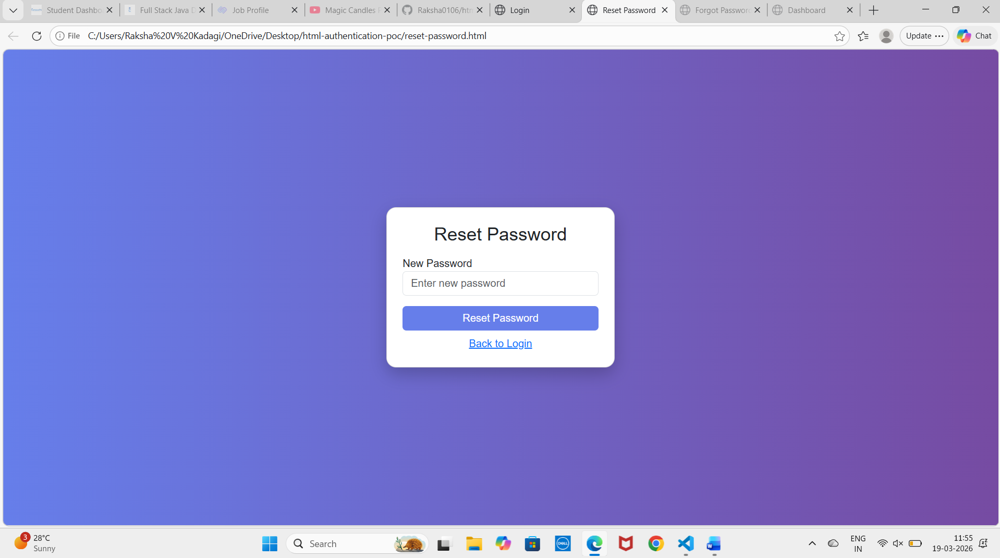
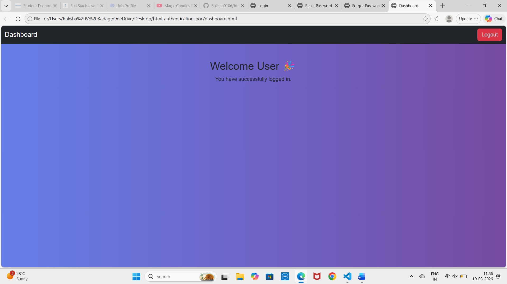

# 🔐 HTML Authentication System (Styled Version)

## 📌 Project Overview

This project is a **modern styled Authentication System** built as part of an assignment.
It includes multiple authentication pages with a clean UI and smooth user experience.

The application is designed using **HTML, CSS, and JavaScript**, enhanced with responsive layouts and interactive features.

---

## 🚀 Features

* 🔑 Login Page
* 📝 Registration Page
* 🔁 Forgot Password Flow
* 🔒 Reset Password Page
* 📊 Dashboard Page
* 👁 Password Show/Hide Toggle
* 📶 Password Strength Indicator
* 🎨 Gradient UI with Custom Styling
* 📱 Fully Responsive Design
* 🔗 Smooth Navigation Between Pages

---

## 🛠 Technologies Used

* HTML5
* CSS3
* JavaScript
* Google Fonts

---

## 📱 Responsive Design

This project works smoothly across all devices:

* 💻 Desktop
* 💼 Laptop
* 📱 Mobile
* 📟 Tablet

---

## 📂 Project Structure

```
html-authentication-poc/
│
├── login.html
├── register.html
├── forgot-password.html
├── reset-password.html
├── dashboard.html
├── style.css
├── script.js
│
└── screenshots/
    ├── login.png
    ├── register.png
    ├── forgot.png
    ├── reset.png
    └── dashboard.png
```

---

## 📸 Screenshots

### 🔐 Login Page



### 📝 Register Page



### 🔁 Forgot Password



### 🔒 Reset Password



### 📊 Dashboard



---

## 🎯 Objectives Completed

* ✔ Clean UI Design
* ✔ Responsive Layout
* ✔ Navigation Between Pages
* ✔ Interactive Features using JavaScript
* ✔ Organized Project Structure

---

## 👩‍💻 Author

**Raksha V Kadagi**
Frontend Assignment Submission

---
